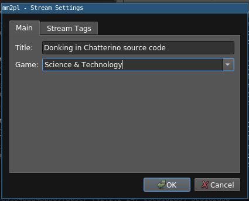

Chatterino 2 [](https://github.com/Mm2PL/chatterino2/actions?query=workflow%3ABuild+branch%3Adankerino)
============

## Dankerino

Dankerino is a fork of Chatterino 2.

### Features of Dankerino

- Shortcuts for whispering Supibot `/$`.
- 7TV emotes, using the official implementation from [here](https://github.com/seventv/chatterino7), disabled by default
- Adjust your spam speed. Useful with chats with slightly higher slow mode than the default 1s.
- Stream settings window (beta)
- A couple more appearance settings compared to upstream Chatterino 2:
 - input placeholder toggle
 - toggle for graying-out recent messages

### Screenshots



### Goals of Dankerino

- Add QOL and features (or fixes) that aren't accepted into the upstream repo.

### Non-goals of Dankerino

- Being something _different_ than Chatterino 2. All features from upstream should be present in Dankerino.

### Downloads
You can download the latest Dankerino build over [here](https://github.com/Mm2PL/dankerino/releases/tag/nightly-build)
Windows users can install Dankerino [from Chocolatey](https://chocolatey.org/packages/dankerino).

### Discord

There is a Dankerino discord, although it's not used for much. The invite link is <https://discord.gg/Qru2TSyNZu>.

## Original Chatterino 2 readme

Chatterino 2 is a chat client for [Twitch.tv](https://twitch.tv).
The Chatterino 2 wiki can be found [here](https://wiki.chatterino.com).
Contribution guidelines can be found [here](https://wiki.chatterino.com/Contributing%20for%20Developers).

## Download

Current releases are available at [https://chatterino.com](https://chatterino.com).
Windows users can also install Chatterino [from Chocolatey](https://chocolatey.org/packages/chatterino).

## Nightly build

You can download the latest Chatterino 2 build over [here](https://github.com/Chatterino/chatterino2/releases/tag/nightly-build)

You might also need to install the [VC++ Redistributables](https://aka.ms/vs/17/release/vc_redist.x64.exe) from Microsoft if you do not have it installed already.  
If you still receive an error about `MSVCR120.dll missing`, then you should install the [VC++ 2013 Restributable](https://download.microsoft.com/download/2/E/6/2E61CFA4-993B-4DD4-91DA-3737CD5CD6E3/vcredist_x64.exe).

## Building

To get source code with required submodules run:

```
git clone --recurse-submodules https://github.com/Chatterino/chatterino2.git
```

or

```
git clone https://github.com/Chatterino/chatterino2.git
cd chatterino2
git submodule update --init --recursive
```

[Building on Windows](../master/BUILDING_ON_WINDOWS.md)

[Building on Windows with vcpkg](../master/BUILDING_ON_WINDOWS_WITH_VCPKG.md)

[Building on Linux](../master/BUILDING_ON_LINUX.md)

[Building on Mac](../master/BUILDING_ON_MAC.md)

[Building on FreeBSD](../master/BUILDING_ON_FREEBSD.md)

## Code style

The code is formatted using clang format in Qt Creator. [.clang-format](src/.clang-format) contains the style file for clang format.

### Get it automated with QT Creator + Beautifier + Clang Format

1. Download LLVM: https://github.com/llvm/llvm-project/releases/download/llvmorg-11.0.0/LLVM-11.0.0-win64.exe
2. During the installation, make sure to add it to your path
3. In QT Creator, select `Help` > `About Plugins` > `C++` > `Beautifier` to enable the plugin
4. Restart QT Creator
5. Select `Tools` > `Options` > `Beautifier`
6. Under `General` select `Tool: ClangFormat` and enable `Automatic Formatting on File Save`
7. Under `Clang Format` select `Use predefined style: File` and `Fallback style: None`

Qt creator should now format the documents when saving it.

## Doxygen

Doxygen is used to generate project information daily and is available [here](https://doxygen.chatterino.com).
